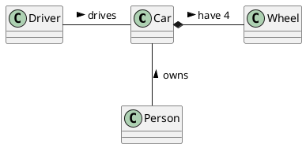

# Titre 1
## Titre 2
### Titre 3

Ceci est un texte

**Ceci est un texte en gras**

*Ceci est un texte en italique*

***Ceci est un texte en gras italique***

`Ceci est stylé`

>**note :** Ceci est une note

Pour voir la documentation du projet, cliquez [ici](documentation/Documentation.md)

## Insérer du code

```php
function toto() : string {
return "toto";
}
```

---

## Diagramme de classes



## Tableau

| entete1 | entete2 |
|----|----|
| Toto | Titi|